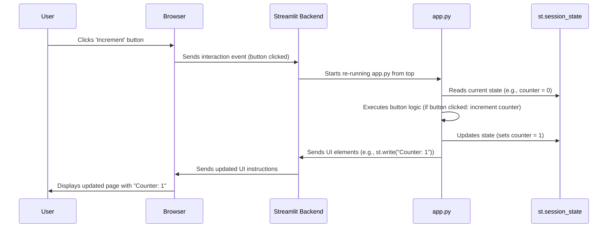

# Chapter 1: Streamlit App Structure & State

Welcome to the first chapter of our tutorial! We're building a cool PubMed Search application, and the very first thing we need to understand is how the application itself is put together and how it remembers things as you use it.

Imagine you're visiting a library. The library has different rooms (like a search room, a reading room, maybe a history section). That's the **structure**. Now, imagine the librarian remembers who you are and what books you were looking at, even if you walk from the search room to the reading room. That's **state**. Our web app needs both a structure and a way to remember things.

In this chapter, we'll learn about:

*   **Streamlit:** The tool we use to build the app's user interface (UI) using Python.
*   **App Structure:** How the different parts of our app (like pages and sidebars) are laid out.
*   **Session State:** How the app remembers information (like who's logged in or the current search results) across your interactions.

Let's dive in!

## What is Streamlit?

Streamlit is a fantastic Python library that lets us build web applications incredibly fast. Instead of needing to learn complex web technologies like HTML, CSS, and JavaScript, we can create interactive UIs using only Python code. It's perfect for data scientists, researchers, and anyone who wants to turn their scripts into shareable web apps without a steep learning curve.

Think of Streamlit as providing easy-to-use building blocks (like titles, buttons, text inputs) that we can assemble with Python to create our app's interface.

## How Streamlit Builds the App Structure

A Streamlit app is essentially a Python script (`.py` file). When you run the script using the `streamlit run your_script.py` command, Streamlit executes the script from top to bottom.

Every time you interact with the app (e.g., click a button, type in a text box), Streamlit **re-runs the entire script**. This might sound strange, but it's Streamlit's magic! It makes building interactive apps much simpler because the code always reflects the current state of the UI elements.

Our `pubmed` application uses a main script (`app.py`) and additional scripts in a `pages/` directory.

*   `app.py`: This is the main entry point, like the front door of our library. It handles things like login and the primary search interface.
*   `pages/`: This special directory contains other Python scripts, each representing a different "page" or "room" in our app (like `pages/4_chatbot.py` for the AI Assistant or `pages/6_search_history.py` for Search History). Streamlit automatically creates a navigation menu in the sidebar to switch between these pages.

Here's a tiny example of how simple Streamlit code looks:

```python
# Import the streamlit library
import streamlit as st

# Add a title to the page
st.title("My Simple App")

# Add a button
if st.button("Click Me!"):
    # This code runs ONLY when the button is clicked
    st.write("Button Clicked!")
```

When you run this, you'll see a title and a button. When you click the button, the script re-runs, `st.button` returns `True`, and the message "Button Clicked!" appears.

## The Need for Memory: Session State

Okay, so Streamlit re-runs the script on every interaction. But wait... if the whole script re-runs, how does the app *remember* anything? How does it know you're still logged in after you click the search button? How does it remember the search results when you go to the next page of results?

This is where **Session State** comes in. It's like a special backpack that each user carries with them while they use the app. Whatever you put in the backpack stays there for their entire session (until they close the browser tab or log out).

Streamlit provides this backpack via `st.session_state`. It works like a Python dictionary where we can store and retrieve information.

**Why is it crucial?** Web applications are typically "stateless" – they forget everything between interactions. `st.session_state` gives our Streamlit app memory.

In our `pubmed` app, we use `st.session_state` to remember:

*   `authenticated`: Is the user currently logged in? (True/False)
*   `current_user`: Who is logged in? (e.g., 'hope')
*   `search_results`: What articles did the last search find?
*   `page_number`: Which page of search results is the user viewing?
*   `conversation`: The history of messages between the user and the AI chatbot.
*   ...and many other details!

## Using Session State in Our App

Let's see how `st.session_state` is used in `app.py`.

**1. Initialization:**

When a user first opens the app, their "backpack" (`st.session_state`) is empty. We need to add the pockets (keys) we plan to use, often setting default values. This usually happens at the beginning of the script.

```python
# app.py (Simplified Snippet)
import streamlit as st

# Initialize session state variables if they don't exist yet

# Remember if the user is logged in (default: False)
if 'authenticated' not in st.session_state:
    st.session_state.authenticated = False

# Remember who is logged in (default: None)
if 'current_user' not in st.session_state:
    st.session_state.current_user = None

# Remember the search results (default: None)
if 'search_results' not in st.session_state:
    st.session_state.search_results = None

# Remember the current page number for results (default: 0)
if 'page_number' not in st.session_state:
    st.session_state.page_number = 0
```

*Explanation:* The `if 'key' not in st.session_state:` check is vital. It ensures we only set the *initial* default value once when the user's session starts. If we didn't have this check, these values would be reset to their defaults every time the script re-runs (on every button click!), and the app would forget everything immediately.

**2. Updating State:**

When something happens, like a user successfully logging in, we update the values in the `st.session_state` backpack.

```python
# auth.py (Conceptual Snippet - called from app.py)
import streamlit as st

def login_user(username, password):
    # ... (code to check if username and password are valid) ...
    is_valid = True # Assume login is successful for this example

    if is_valid:
        # Put the login status and username into the session state backpack
        st.session_state.authenticated = True
        st.session_state.current_user = username
        st.success("Login Successful!")
        # Need to rerun the script to show the main page
        st.rerun()
    else:
        st.error("Invalid credentials")
```

*Explanation:* When `login_user` finds a valid login, it changes `st.session_state.authenticated` to `True` and stores the `username` in `st.session_state.current_user`. `st.rerun()` tells Streamlit to immediately re-run the `app.py` script from the top.

**3. Reading State:**

Throughout the app, we check the values in `st.session_state` to decide what to show or do.

```python
# app.py (Simplified Snippet)

# Check the backpack to see if the user is logged in
if not st.session_state.authenticated:
    # Show login/registration page if not logged in
    # login_page() # Function call
    st.write("Please log in.") # Simplified for example
else:
    # Show the main search page if logged in
    # search_page() # Function call
    st.write(f"Welcome, {st.session_state.current_user}!") # Read username
    st.write("Displaying search page...") # Simplified for example
```

*Explanation:* This code checks the `authenticated` value we stored earlier. If it's `False`, it shows the login part; if it's `True`, it greets the user (using `st.session_state.current_user`) and shows the main search functionality.

## Under the Hood: How it Works

Let's visualize a simple interaction: clicking a button that updates a counter stored in session state.



Key takeaways:

1.  **Interaction Triggers Rerun:** Any widget interaction (button click, text input, etc.) causes the *entire script* to run again.
2.  **Session State Persists:** The `st.session_state` object is preserved by the Streamlit Backend for that specific user's session across these reruns.
3.  **Code Reads/Writes State:** Your script reads the current state from `st.session_state` and writes updates back to it.
4.  **UI Reflects State:** The UI elements generated by the script (like `st.write`) naturally reflect the values currently held in `st.session_state` during that specific rerun.

## Conclusion

We've learned that Streamlit lets us build web app UIs using Python. The app's structure comes from how we arrange Streamlit elements in our script (`app.py`) and potentially across multiple files in a `pages/` directory.

Crucially, because Streamlit re-runs the script on every interaction, we need a way to remember information. `st.session_state` acts as our app's memory for each user session, allowing us to store data like login status, search results, and user preferences. We initialize state variables carefully using `if 'key' not in st.session_state:` and then read from and write to `st.session_state` throughout the app to create dynamic and stateful experiences.

Now that we understand the basic container and memory of our app, we need to figure out how to actually get the research articles. In the next chapter, we'll explore how our app communicates with the official PubMed database using the [PubMed API Client](02_pubmed_api_client_.md).

---

Generated by [AI Codebase Knowledge Builder](https://github.com/The-Pocket/Tutorial-Codebase-Knowledge)