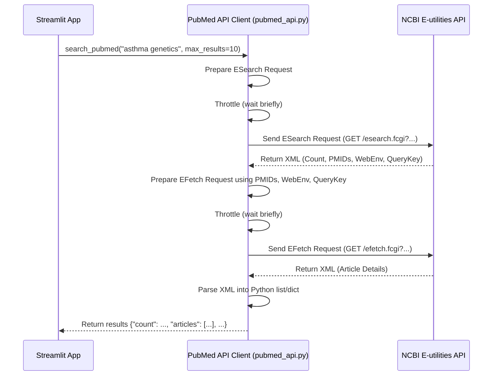

# Chapter 2: PubMed API Client

Welcome to Chapter 2! In the [previous chapter](01_streamlit_app_structure___state_.md), we learned how our application is built using Streamlit and how it remembers things using `st.session_state`. Now, our app needs to actually *do* something useful – like finding research articles!

But where do these articles come from? They live in a massive online library called PubMed, maintained by the NCBI (National Center for Biotechnology Information). Our app can't just magically grab articles; it needs a way to formally ask the PubMed library for information.

This chapter introduces the **PubMed API Client**: our application's dedicated librarian.

## The Problem: Getting Data from PubMed

Imagine you walk into a giant library (PubMed) looking for books (research articles) about "new treatments for diabetes". You can't just wander around hoping to find them. You need to talk to the librarian, tell them what you're looking for, and they will use the library's system to find the right books and bring them to you.

Our app faces the same challenge. When a user types a search query like "diabetes treatment", the app needs a component that knows:

1.  **Where** to ask for information (the PubMed online system).
2.  **How** to ask correctly (using the specific rules of the PubMed API).
3.  **What** to do with the response (fetch article details, handle errors).
4.  **How** to be polite (not overwhelming the PubMed system with too many requests too quickly).

This is exactly what our **PubMed API Client** module (`pubmed_api.py`) does.

## What is an API and an API Client?

*   **API (Application Programming Interface):** Think of an API as a menu or a set of rules that one computer program (like the PubMed database) provides so other programs (like our app) can communicate with it. It defines *how* you can ask for things (e.g., "search for articles", "get article details") and what format the answers will be in. PubMed offers the "E-utilities" API for this purpose.
*   **API Client:** This is the part of *our* application that *uses* the API. Our `pubmed_api.py` module is the client. It knows how to format requests according to the E-utilities API rules, send those requests, understand the responses, and handle communication details. It's our app's personal expert on talking to PubMed.

## Key Tasks of Our PubMed API Client

Our API client acts as the intermediary between our Streamlit app and the official NCBI PubMed database. Its main jobs are:

1.  **Sending Search Queries:** Takes a user's search term (e.g., "crispr gene editing") and sends it to PubMed using the `esearch` utility to find relevant article IDs.
2.  **Fetching Article Details:** Takes a list of article IDs (like PMIDs - PubMed Unique Identifiers) and asks PubMed for more details (title, abstract, authors, journal, etc.) using the `efetch` utility.
3.  **Finding Related Articles:** Given a specific article's PMID, it can ask PubMed for other similar articles using the `elink` utility.
4.  **Managing API Usage (Throttling):** PubMed has rules about how often you can send requests. Our client includes small delays (`time.sleep`) between requests to be polite and avoid getting blocked. This is called "throttling".

## How Our App Uses the API Client

Let's imagine the user just typed "asthma genetics" into the search bar on our app's main page and clicked "Search". What happens next involves our API Client.

Conceptually, the code in our main app (`app.py`) would do something like this:

```python
# app.py (Simplified Concept)
import streamlit as st
# Import the functions from our API client module
from pubmed_api import search_pubmed

# --- (Inside the part of the app that handles the search button click) ---

search_query = st.session_state.user_input # e.g., "asthma genetics"
results_per_page = 10
current_page = st.session_state.page_number # e.g., 0 for the first page

# Call the API client's search function
try:
    api_results = search_pubmed(
        query=search_query,
        max_results=results_per_page,
        start=current_page * results_per_page
    )

    # Store the results in session state
    st.session_state.search_results = api_results
    st.success(f"Found {api_results.get('count', 0)} articles!")

except Exception as e:
    st.error(f"Failed to fetch results: {e}")

# --- (Later code will display these results) ---
```

**Explanation:**

1.  We import the `search_pubmed` function from our `pubmed_api.py` module.
2.  When the user searches, we gather the search query and pagination details (how many results per page, which page we are on).
3.  We call `search_pubmed`, passing the query and other parameters. This is where our app talks to the API Client.
4.  The `search_pubmed` function (inside the client) handles all the communication with the actual PubMed API.
5.  It returns a dictionary (`api_results`) containing the list of found articles and total count.
6.  We store these results in `st.session_state` so the rest of the app can access and display them (which we'll cover in the next chapter).

The app itself doesn't need to know the complicated details of HTTP requests, XML parsing, or API keys; it just calls a function in our client module.

## Under the Hood: How `search_pubmed` Works

When our app calls `search_pubmed(query="...", max_results=...)`, what steps does the API Client take?

1.  **Prepare ESearch Request:** The client constructs a specific URL and parameters for the PubMed `esearch` utility. This includes the search term, how many results to find IDs for, sorting preferences, and identification details (our app's name `TOOL` and contact `EMAIL` from `config.py`). It also adds the `NCBI_API_KEY` if available (which allows slightly faster requests).
2.  **Throttle:** It pauses for a very short time (`time.sleep`) to respect NCBI's usage limits (e.g., 0.1 seconds if using an API key, or 0.34 seconds without).
3.  **Send ESearch Request:** It uses the `requests` library to send the request over the internet to the NCBI E-utilities server.
4.  **Receive ESearch Response:** It gets back an XML response containing the total count of matching articles and, importantly, a list of PubMed IDs (PMIDs) for the first batch of results. It also gets `WebEnv` and `QueryKey` values, which act like a temporary ticket to refer back to this specific search later (useful for getting the *next* page of results without repeating the whole search).
5.  **Prepare EFetch Request:** The client now constructs *another* URL and parameters, this time for the `efetch` utility. It includes the list of PMIDs received from `esearch`, the `WebEnv` and `QueryKey`, and specifies that it wants the abstract and other details (`rettype=abstract`, `retmode=xml`). It again includes identification details and the API key.
6.  **Throttle:** It pauses briefly again.
7.  **Send EFetch Request:** It sends this second request to NCBI.
8.  **Receive EFetch Response:** It gets back a more detailed XML response containing the full information (title, abstract, authors, journal, date, etc.) for the requested articles.
9.  **Parse XML:** The client uses Python's `xml.etree.ElementTree` library to carefully read through the complex XML structure and extract the relevant pieces of information for each article. It organizes this into a cleaner format, like a list of Python dictionaries.
10. **Return Results:** Finally, it returns this structured list of article dictionaries, along with the total count, `WebEnv`, and `QueryKey`, back to the part of our app that called it.

Let's visualize this communication flow:



## Peeking at the Code (`pubmed_api.py`)

Let's look at simplified snippets from `pubmed_api.py` to see these steps in action.

**1. Sending the Initial Search (`esearch`)**

```python
# pubmed_api.py (Simplified Snippet 1)
import requests
import time
from config import BASE_URL, EMAIL, TOOL, NCBI_API_KEY

def search_pubmed(query, max_results=20, start=0, sort="relevance"):
    # Be polite! Wait before making a request.
    if NCBI_API_KEY:
        time.sleep(0.1) # Faster allowed with API key
    else:
        time.sleep(0.34) # Slower required without API key

    # --- Initial search to get IDs, WebEnv, QueryKey ---
    search_url = f"{BASE_URL}esearch.fcgi"
    search_params = {
        "db": "pubmed",
        "term": query,
        "retmax": max_results, # How many IDs to get initially
        "sort": sort,
        "usehistory": "y", # Essential for getting WebEnv/QueryKey
        "tool": TOOL,      # Identify our app
        "email": EMAIL,    # Provide contact info
    }
    if NCBI_API_KEY:
        search_params["api_key"] = NCBI_API_KEY # Add key if we have one

    try:
        # Send the request to NCBI
        search_response = requests.get(search_url, params=search_params)
        search_response.raise_for_status() # Check for errors like 404 Not Found

        # ... Code here to parse the XML response from esearch ...
        # Extracts: count, webenv, query_key, list_of_pmids
        # (Parsing logic is complex, omitted for simplicity)
        count = 150 # Dummy value
        webenv = "NCID_1_ABCD..." # Dummy value
        query_key = "1" # Dummy value

    except requests.exceptions.RequestException as e:
        st.error(f"PubMed API request error: {e}")
        return {"count": 0, "articles": [], "webenv": None, "query_key": None}
    # ... continue to efetch ...
```

*Explanation:* This part builds the parameters for the `esearch` call, including our identifying information (`TOOL`, `EMAIL`, optional `api_key` from `config.py`). It includes the crucial `usehistory=y` to enable pagination using `WebEnv` and `QueryKey`. It waits (`time.sleep`), sends the request using `requests.get`, and includes basic error checking. The actual XML parsing to get IDs, count, `WebEnv`, and `QueryKey` is done here but simplified in this snippet.

**2. Fetching Article Details (`efetch`)**

```python
# pubmed_api.py (Simplified Snippet 2 - continuation of search_pubmed)

    # --- Now fetch details using WebEnv and QueryKey ---
    fetch_url = f"{BASE_URL}efetch.fcgi"
    fetch_params = {
        "db": "pubmed",
        "retmode": "xml",        # We want XML data
        "rettype": "abstract",   # We want abstracts and details
        "WebEnv": webenv,        # Use the history ticket
        "query_key": query_key,  # Use the history ticket key
        "retmax": max_results,   # How many articles to fetch details for
        "retstart": start,       # Which result to start fetching from (for pagination)
        "tool": TOOL,
        "email": EMAIL
    }
    if NCBI_API_KEY:
        fetch_params["api_key"] = NCBI_API_KEY

    try:
        # Be polite again before the second request!
        if NCBI_API_KEY: time.sleep(0.1)
        else: time.sleep(0.34)

        # Send the efetch request
        fetch_response = requests.get(fetch_url, params=fetch_params)
        fetch_response.raise_for_status()

        # Parse the detailed XML response into a list of dictionaries
        articles = parse_pubmed_xml(fetch_response.content) # Calls helper function

        return {"count": count, "articles": articles, "webenv": webenv, "query_key": query_key}

    except requests.exceptions.RequestException as e:
        st.error(f"PubMed API request error: {e}")
        # Return empty but keep webenv/query_key for potential retries
        return {"count": 0, "articles": [], "webenv": webenv, "query_key": query_key}
    except ET.ParseError as e: # Handle XML parsing errors
        st.error(f"XML parsing error: {e}")
        return {"count": 0, "articles": [], "webenv": webenv, "query_key": query_key}

def parse_pubmed_xml(xml_content):
    # ... Complex code using xml.etree.ElementTree to extract ...
    # ... title, abstract, authors, journal, date, pmid, doi ...
    # Returns a list of dictionaries, e.g.:
    # [ {'pmid': '123', 'title': '...', 'abstract': '...', ...}, ... ]
    print("Parsing XML content...") # Placeholder
    return [{"pmid": "12345", "title": "Sample Article", "abstract": "This is a sample abstract.", "authors": "Smith J, Doe J", "journal": "Sample Journal", "pub_date": "2023"}] # Dummy data
```

*Explanation:* This second part uses the `webenv` and `query_key` obtained from `esearch` to tell PubMed exactly which search results we want details for. It specifies the format (`xml`) and type (`abstract`) of data needed. Again, it throttles, sends the request, and then calls a separate helper function (`parse_pubmed_xml`) to handle the intricate task of extracting data from the returned XML. Finally, it bundles the parsed `articles` list with the `count`, `webenv`, and `query_key` into a dictionary to return to the main app.

**3. Finding Related Articles (`elink`)**

The client also has a function like `get_related_articles(pmid)`, which works similarly but uses the `elink` utility to find articles related to a *specific* known article ID.

```python
# pubmed_api.py (Simplified Snippet 3)
def get_related_articles(pmid, max_results=10):
    # Throttle first...
    if NCBI_API_KEY: time.sleep(0.1)
    else: time.sleep(0.34)

    # Use elink to find related PMIDs
    elink_url = f"{BASE_URL}elink.fcgi"
    elink_params = {
        "dbfrom": "pubmed",
        "db": "pubmed",
        "id": pmid, # The specific article ID
        "linkname": "pubmed_pubmed", # Find related PubMed articles
        "retmax": max_results,
        # ... add tool, email, api_key ...
    }
    # Send request, get XML response with related PMIDs... (simplified)
    related_ids = ["67890", "11223"] # Dummy related IDs

    if not related_ids:
        return {"count": 0, "articles": []}

    # Now fetch details for these related IDs using efetch
    # (Similar to the efetch step in search_pubmed, but uses the related_ids list)
    # ... send efetch request ...
    # ... parse response using parse_pubmed_xml ...
    related_articles = parse_pubmed_xml("...") # Dummy call

    return {"count": len(related_articles), "articles": related_articles}
```

*Explanation:* This function first uses `elink` to ask PubMed "Which articles are related to this specific `pmid`?". It gets back a list of related PMIDs. Then, it uses `efetch` (just like in the search function) to get the full details for those related articles.

## Conclusion

The PubMed API Client (`pubmed_api.py`) is a vital component of our application. It acts as the knowledgeable librarian, handling all communication with the official NCBI PubMed E-utilities API. It takes simple requests from our app (like "search for this term") and translates them into the specific, polite, multi-step process required by PubMed, involving `esearch` to find IDs, `efetch` to get details, `elink` to find related papers, and careful throttling (`time.sleep`) to follow usage rules. It hides the complexity of API calls and XML parsing, providing clean, structured data back to the main application.

We now understand how our app gets the raw article data. But raw data isn't very user-friendly! In the next chapter, we'll look at how to take the results from the API client and present them nicely to the user in [Result Presentation & Formatting](03_result_presentation___formatting_.md).

---
