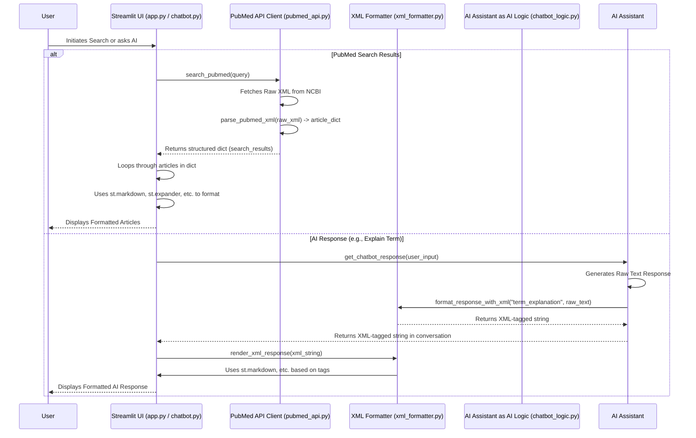

# Chapter 3: Result Presentation & Formatting

Welcome to Chapter 3! In the [previous chapter on the PubMed API Client](02_pubmed_api_client_.md), we learned how our application acts like a librarian, fetching raw information (like article details) from the vast PubMed library. We successfully got the data, often in a format called XML, which looks a bit like code and isn't very friendly to read directly.

Think about it: if the librarian just handed you a pile of raw printing press templates (XML) or scribbled notes (raw AI responses), it wouldn't be very helpful, right? You need the information presented clearly, like in a nicely printed book or a well-organized report.

That's exactly what **Result Presentation & Formatting** is all about! This part of our project acts like a graphic designer or a typesetter. Its job is to take the raw, sometimes messy, data and make it look good and easy to understand for the user in our Streamlit app.

In this chapter, we'll explore:

*   Why raw data needs formatting.
*   How we process PubMed's XML data.
*   How we structure responses from our AI assistant.
*   How we use Streamlit to display everything nicely.

## The Problem: Raw Data is Hard to Read

Our [PubMed API Client](02_pubmed_api_client_.md) gets article details from PubMed as XML. XML (eXtensible Markup Language) uses tags (like `<Title>...</Title>`) to structure data. It's great for computers to understand, but not for humans to read directly.

Here's a tiny (and simplified) glimpse of what raw XML might look like:

```xml
<PubmedArticle>
    <MedlineCitation Status="MEDLINE" Owner="NLM">
        <PMID Version="1">12345678</PMID>
        <Article PubModel="Print">
            <Journal>
                <Title>Journal of important discoveries</Title>
            </Journal>
            <ArticleTitle>A study on making data readable.</ArticleTitle>
            <Abstract>
                <AbstractText Label="BACKGROUND">Raw data is messy.</AbstractText>
                <AbstractText Label="METHODS">We used formatting.</AbstractText>
                <AbstractText Label="RESULTS">Data became readable.</AbstractText>
                <AbstractText Label="CONCLUSION">Formatting is good.</AbstractText>
            </Abstract>
            <AuthorList CompleteYN="Y">
                <Author ValidYN="Y">
                    <LastName>Smith</LastName>
                    <ForeName>Jane</ForeName>
                </Author>
            </AuthorList>
        </Article>
    </MedlineCitation>
</PubmedArticle>
```

Similarly, when our [AI Research Assistant Logic](04_ai_research_assistant_logic_.md) provides an explanation or analysis, it might just be plain text. We need to add structure (like headings, lists, or highlighted sections) to make it clear.

## Key Tasks of Result Formatting

Our "graphic designer" component needs to perform several key tasks:

1.  **Parse PubMed XML:** Read the complex XML structure from PubMed and pull out the important pieces like the title, authors, abstract sections, journal name, and publication date. We store this extracted information in a more convenient Python format, usually a dictionary.
2.  **Format Article Details:** Take the extracted Python dictionary for an article and use Streamlit's display functions (`st.markdown`, `st.expander`, `st.info`, etc.) to show it with clear headings, paragraphs, lists, and maybe even colored boxes for different abstract sections.
3.  **Structure AI Responses:** When the AI provides text (like explaining a medical term or analyzing research gaps), we wrap different parts of the text in our *own* simple XML tags (e.g., `<term>`, `<definition>`, `<gap>`). This helps us know which part is which.
4.  **Render Structured AI Responses:** Read our custom XML-tagged AI responses and use Streamlit functions to display them appropriately. For example, display text inside `<term>` tags as a heading and text inside `<definition>` tags as regular text below it.

## From Raw XML to Readable Output: PubMed Articles

Let's follow the journey of a PubMed article's data.

**Step 1: Parsing XML (Happens inside the API Client)**

In Chapter 2, we mentioned the `parse_pubmed_xml` function within our `pubmed_api.py` client. While the exact code is complex, its *job* is crucial for presentation. It takes the raw XML string (like the example above) and turns it into a Python dictionary.

```python
# pubmed_api.py (Conceptual Snippet - Result of Parsing)

def parse_pubmed_xml(xml_content):
    # ... complex XML parsing logic using ElementTree ...
    # Goal: Extract relevant fields

    # Example output dictionary for one article:
    article_data = {
        "pmid": "12345678",
        "title": "A study on making data readable.",
        "authors": "Smith J",
        "journal": "Journal of important discoveries",
        "pub_date": "2023", # Extracted year/date
        "abstract": "BACKGROUND: Raw data is messy. METHODS: We used formatting. RESULTS: Data became readable. CONCLUSION: Formatting is good.",
        "abstract_sections": { # NEW: Structured abstract
             "BACKGROUND": "Raw data is messy.",
             "METHODS": "We used formatting.",
             "RESULTS": "Data became readable.",
             "CONCLUSION": "Formatting is good."
        },
        "pubmed_url": "https://pubmed.ncbi.nlm.nih.gov/12345678/"
        # ... other fields like DOI ...
    }
    return [article_data] # Returns a list containing dictionaries like this
```

*Explanation:* The `parse_pubmed_xml` function digests the messy XML and gives us back a clean Python dictionary (`article_data`) for each article. Notice how it extracts key fields and even tries to separate the abstract into labeled sections if the original XML provides them (`abstract_sections`). This dictionary is much easier to work with in our main app.

**Step 2: Displaying in Streamlit (`app.py`)**

Now, our main application script (`app.py`) takes this dictionary (stored in `st.session_state.search_results['articles']` after a search) and uses Streamlit commands to display it.

```python
# app.py (Simplified Snippet - Displaying one article)
import streamlit as st

# Assume 'article' is one dictionary from st.session_state.search_results['articles']
# Example: article = {"title": "Making Data Readable", "authors": "Smith J", ...}

# Use an expander to keep the UI clean
with st.expander(f"{article['title']}", expanded=True):
    st.markdown(f"**Authors:** {article.get('authors', 'N/A')}")
    st.markdown(f"**Journal:** {article.get('journal', 'N/A')}")
    st.markdown(f"**Published:** {article.get('pub_date', 'N/A')}")

    # Display the abstract, preferably structured
    st.markdown("### Abstract")
    if 'abstract_sections' in article and article['abstract_sections']:
        # Display structured abstract sections with formatting
        if 'BACKGROUND' in article['abstract_sections']:
             st.markdown("#### 📚 Background")
             st.markdown(article['abstract_sections']['BACKGROUND'])
        if 'METHODS' in article['abstract_sections']:
             st.markdown("#### 🔬 Methodology")
             st.success(article['abstract_sections']['METHODS']) # Green box!
        # ... (display other sections like RESULTS, CONCLUSION with st.info, st.warning) ...
    else:
        # Fallback for unstructured abstracts
        st.markdown(article.get('abstract', 'No abstract available.'))

    # Add links
    st.markdown(f"[View on PubMed]({article.get('pubmed_url', '#')})")
```

*Explanation:* This code uses `st.expander` to create a clickable section for each article. Inside, `st.markdown` is used to display text, using Markdown syntax like `**...**` for bold text. Crucially, it checks if `abstract_sections` exists. If yes, it prints each section with a heading and uses special Streamlit containers like `st.success` (green box) or `st.info` (blue box) for visual emphasis. If not, it just shows the plain abstract text.

## From Plain Text to Structured Output: AI Responses

Our AI assistant generates helpful text, but we want to present it clearly.

**Step 1: Structuring with XML Tags (`xml_formatter.py`)**

We create a helper module, `xml_formatter.py`, which contains functions to wrap the AI's raw text output in simple XML tags. This adds structure that tells our app how to display different parts.

```python
# xml_formatter.py (Simplified Snippet - Formatting a Term Explanation)
import re # Needed for simple text processing

def format_response_with_xml(response_type, content):
    """Wrap AI content in basic XML tags based on response type."""

    if response_type == "term_explanation":
        # Assume content is like "Term: Definition"
        parts = content.split(":", 1)
        term = parts[0].strip() if len(parts) > 0 else "Term"
        definition = parts[1].strip() if len(parts) > 1 else content

        # Return XML-tagged string
        return f"""
<response type="term_explanation">
    <term>{term}</term>
    <definition>{definition}</definition>
</response>
"""
    # ... (similar logic for "methodology", "research_gaps", etc.) ...
    else:
        return f"""
<response type="general">
    <content>{content}</content>
</response>
"""
```

*Explanation:* This function takes the `response_type` (e.g., `"term_explanation"`) and the raw `content` from the AI. For explanations, it tries to split the term from its definition and wraps them in `<term>` and `<definition>` tags, respectively. The whole thing is wrapped in a `<response>` tag indicating the type.

**Step 2: Rendering Structured XML (`xml_formatter.py` and `pages/4_chatbot.py`)**

Another function in `xml_formatter.py` reads this structured XML string and uses Streamlit commands to render it. This function is then called from our chatbot page (`pages/4_chatbot.py`).

```python
# xml_formatter.py (Simplified Snippet - Rendering the XML)
import streamlit as st
import re # Needed for extracting content from tags

def render_xml_response(xml_string):
    """Render our custom XML using Streamlit elements."""
    try:
        # Find the response type
        type_match = re.search(r'<response type="([^"]+)">', xml_string)
        response_type = type_match.group(1) if type_match else "general"

        if response_type == "term_explanation":
            # Extract content from tags
            term = re.search(r'<term>(.*?)</term>', xml_string).group(1)
            definition = re.search(r'<definition>(.*?)</definition>', xml_string).group(1)

            # Use Streamlit to display
            st.markdown(f"### {term}") # Term as a sub-header
            st.markdown(definition)    # Definition as regular text

        # ... (elif blocks for other response types like "methodology", "research_gaps") ...

        else: # General content
            content = re.search(r'<content>(.*?)</content>', xml_string).group(1)
            st.markdown(content)

    except Exception as e:
        st.error(f"Error rendering response: {e}")
        st.markdown(xml_string) # Fallback: show raw string if parsing fails
```

```python
# pages/4_chatbot.py (Simplified Snippet - Using the renderer)
import streamlit as st
from xml_formatter import render_xml_response

# Assume 'message' is a dictionary from the chatbot conversation
# Example: message = {"role": "assistant", "content": "<response>...</response>"}

if message["role"] == "assistant":
    st.markdown("**Assistant:**")
    render_xml_response(message["content"]) # Call our rendering function
else:
    # ... (display user message) ...
```

*Explanation:* The `render_xml_response` function uses basic text searching (`re.search`) to find our custom tags (like `<term>`, `<definition>`). Based on the `response_type` and the tags found, it calls different Streamlit functions (`st.markdown`, maybe `st.info`, `st.success` etc. for other types) to create a nicely formatted output in the chatbot interface. The chatbot page simply calls this function for assistant messages.

## Under the Hood: The Formatting Flow

Let's visualize the process for displaying both a PubMed article and an AI response.



**Walkthrough:**

1.  **User Action:** The user either performs a search or asks the AI a question.
2.  **Data Fetching:**
    *   For searches, the [PubMed API Client](02_pubmed_api_client_.md) gets raw XML, *parses* it into Python dictionaries using `parse_pubmed_xml`, and sends the structured dictionary back to the UI (`app.py`).
    *   For AI questions, the [AI Research Assistant Logic](04_ai_research_assistant_logic_.md) gets a raw text response.
3.  **Formatting/Structuring:**
    *   `app.py` directly uses Streamlit functions to format the article dictionaries.
    *   The AI Logic sends its raw text to `xml_formatter.py`'s `format_response_with_xml` function to add our custom XML tags. The tagged string goes back to the UI (`pages/4_chatbot.py`).
4.  **Rendering:**
    *   `app.py` renders articles directly.
    *   `pages/4_chatbot.py` sends the XML-tagged AI response to `xml_formatter.py`'s `render_xml_response` function, which interprets the tags and uses appropriate Streamlit functions.
5.  **Display:** The Streamlit UI shows the nicely formatted results (articles or AI responses) to the user.

## Conclusion

Raw data, whether it's XML from PubMed or plain text from an AI, needs refinement before being shown to the user. Our **Result Presentation & Formatting** layer acts like a crucial translator and designer.

We learned how functions like `parse_pubmed_xml` (in `pubmed_api.py`) turn PubMed's complex XML into usable Python dictionaries. We saw how `app.py` uses Streamlit elements like `st.expander`, `st.markdown`, and colored boxes (`st.success`, `st.info`) to display these dictionaries clearly.

We also saw how the `xml_formatter.py` module helps structure AI responses using simple XML tags (`format_response_with_xml`) and then renders these tags into formatted output in the Streamlit UI using `render_xml_response`.

By separating the fetching of data (Chapter 2) from its presentation (this chapter), we keep our code organized and make it easier to change how things look without changing how we get the data.

Now that we know how to get data and make it look good, let's dive into the brain behind some of that data: the AI itself! In the next chapter, we'll explore the [AI Research Assistant Logic](04_ai_research_assistant_logic_.md).

---

