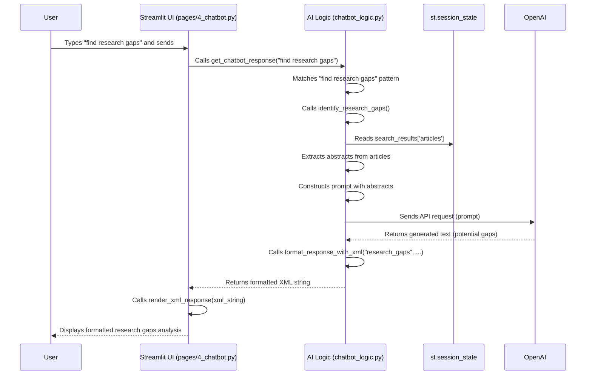

# Chapter 4: AI Research Assistant Logic

Welcome to Chapter 4! In the [previous chapter](03_result_presentation___formatting_.md), we learned how to take the raw data fetched from PubMed and make it look nice and readable in our Streamlit app. We acted like graphic designers, formatting article details and AI responses.

Now, let's talk about the "AI" part of those responses. Where does the intelligence come from? How does the app understand what you're asking in plain English, like "Explain this term" or "What are the main weaknesses of this study?"

This chapter dives into the **AI Research Assistant Logic**, the brain behind our chatbot feature. Think of it as a smart research helper sitting beside you, ready to answer your questions about the articles you've found.

## The Problem: Answering Your Research Questions

Imagine you've just searched PubMed and found a list of interesting articles. You're reading an abstract, and you come across a complex medical term like "macrophage activation syndrome." Or maybe you wonder, "Are there any obvious gaps in the research shown here?"

You could manually search for the term's definition or spend hours analyzing the abstracts yourself. But wouldn't it be great if you could just *ask* the app?

That's the problem our AI Research Assistant Logic solves. It provides a way for you to interact with the search results using natural language, getting intelligent explanations, analyses, and suggestions without leaving the app.

## What is the AI Research Assistant Logic?

This logic is the core intelligence of our chatbot. It uses a powerful external service, the **OpenAI API**, to understand your requests and generate helpful responses. Here's what it does:

1.  **Understands Your Questions:** It takes your input (like "What is CRISPR?") and figures out what you want to know.
2.  **Uses Context:** It looks at the current search results stored in our app's memory ([Streamlit App Structure & State](01_streamlit_app_structure___state_.md)) to make its answers relevant to the articles you're seeing.
3.  **Connects to OpenAI:** It sends your request (and relevant context, like article abstracts) to the OpenAI API. Think of OpenAI as a highly knowledgeable, general-purpose AI brain we can rent.
4.  **Performs Specific Tasks:** Based on your request, it asks the OpenAI API to:
    *   **Detect Medical Terms:** Find potentially confusing terms in an abstract.
    *   **Explain Concepts:** Define terms or explain ideas in simple language.
    *   **Analyze Methodologies:** Summarize how a study was conducted, including its strengths and weaknesses.
    *   **Identify Research Gaps:** Suggest areas where more research might be needed based on the current articles.
    *   **Compare Studies:** Highlight similarities and differences between selected articles.
5.  **Generates Formatted Responses:** It receives the raw answer from OpenAI and works with our [Result Presentation & Formatting](03_result_presentation___formatting_.md) tools (like `xml_formatter.py`) to structure the response clearly before showing it to you.

It's like having a research assistant who can instantly read the abstracts you've found and give you insightful summaries or definitions on demand.

## How We Use the AI Assistant

Let's trace what happens when you interact with the chatbot on the `pages/4_chatbot.py` page.

**Scenario:** You have searched for "diabetes type 2 treatments" and the results are displayed. You go to the Chatbot page and type: "Explain the term 'metformin'".

1.  **You Type:** You enter "Explain the term 'metformin'" into the chat input box and press Send.
2.  **App Receives Input:** The Streamlit page (`pages/4_chatbot.py`) gets your text input.
3.  **Call the Brain:** It calls the main function in our AI logic module, let's say `get_chatbot_response("Explain the term 'metformin'")` located in `chatbot_logic.py`.
4.  **Interpret Request:** Inside `get_chatbot_response`, the code analyzes your input. It recognizes keywords like "Explain the term" and identifies "metformin" as the term you want defined.
5.  **Prepare OpenAI Request:** The logic constructs a specific instruction (a "prompt") for the OpenAI API. It might look something like: "You are a medical expert. Explain the term 'metformin' in simple terms a patient can understand."
6.  **Call OpenAI:** The code sends this prompt to the OpenAI API service over the internet using the `openai` Python library.
7.  **OpenAI Processes:** OpenAI's powerful AI models process the prompt and generate a text explanation for "metformin".
8.  **Receive Response:** The OpenAI API sends the generated text back to our `chatbot_logic.py`.
9.  **Format Response:** The `chatbot_logic.py` function might take the raw text (e.g., "Metformin is a common drug...") and pass it to our `xml_formatter.py` ([Result Presentation & Formatting](03_result_presentation___formatting_.md)) to wrap it in helpful XML tags, like `<term>Metformin</term><definition>...</definition>`.
10. **Send to UI:** The formatted response (the XML string) is sent back to the `pages/4_chatbot.py` page.
11. **Display:** The chatbot page uses the `render_xml_response` function (also from Chapter 3) to display the explanation nicely formatted in the chat window.

## Peeking at the Code (`chatbot_logic.py`)

Let's look at some *simplified* code snippets from `chatbot_logic.py` to see how this works.

**1. Handling User Input (`get_chatbot_response`)**

This function is the main entry point. It tries to understand the user's request.

```python
# chatbot_logic.py (Simplified Snippet 1)
import streamlit as st
import openai
import re # For pattern matching
from config import OPENAI_API_KEY # Your API key
from xml_formatter import format_response_with_xml, render_xml_response # From Chapter 3

# Initialize OpenAI library (needs your API key)
openai.api_key = OPENAI_API_KEY

def get_chatbot_response(user_input):
    """Processes user input and decides what action to take."""

    # --- Simple Keyword/Pattern Matching ---
    # Example: Check if user wants to explain a term
    term_match = re.search(r"explain (?:the )?term ['\"](.+?)['\"]", user_input, re.IGNORECASE)
    if term_match:
        term = term_match.group(1)
        # Call a specific function to handle term explanation
        return explain_medical_term(term)

    # Example: Check if user wants to find research gaps
    gap_match = re.search(r"find research gaps", user_input, re.IGNORECASE)
    if gap_match:
        # Call function to identify gaps using current results
        return identify_research_gaps()

    # --- If no specific command matches, use OpenAI for a general response ---
    else:
        # Fallback to general AI chat
        # ... (Code to send user_input directly to OpenAI for a conversational reply) ...
        # For simplicity, we'll just return a basic message here
        return format_response_with_xml("general", "I can help with explaining terms, analyzing methods, or finding gaps. How can I assist?")

```

*Explanation:* This function first tries to find specific keywords or patterns (like "explain term" or "find research gaps") using `re.search`. If it finds a match, it calls another function dedicated to that task (like `explain_medical_term` or `identify_research_gaps`). If no specific command is recognized, it could potentially send the raw input to OpenAI for a more general chat response (though we simplified it here).

**2. Explaining a Term (`explain_medical_term`)**

This function focuses on generating explanations.

```python
# chatbot_logic.py (Simplified Snippet 2)

def explain_medical_term(term):
    """Generates an explanation for a medical term using OpenAI."""
    if not openai.api_key:
        return format_response_with_xml("general", "OpenAI API key not configured.")

    try:
        # Construct the prompt for OpenAI
        prompt_messages = [
            {"role": "system", "content": "You are a medical expert. Explain the following term in simple language."},
            {"role": "user", "content": f"Term: {term}"}
        ]

        # Send the request to OpenAI
        response = openai.chat.completions.create(
            model="gpt-4o-mini", # A specific OpenAI model
            messages=prompt_messages,
            max_tokens=150 # Limit the response length
        )

        # Get the text answer from OpenAI's response
        explanation_text = response.choices[0].message.content

        # Format the response using our XML formatter
        formatted_response = format_response_with_xml(
            "term_explanation", f"{term}: {explanation_text}"
        )
        return formatted_response

    except Exception as e:
        # Handle errors if OpenAI call fails
        return format_response_with_xml("general", f"Sorry, error explaining '{term}': {e}")

```

*Explanation:*
1.  It defines a `prompt_messages` list. This tells the AI its role ("system" message) and what the user is asking ("user" message).
2.  It calls `openai.chat.completions.create`, sending the messages and specifying the AI model (`gpt-4o-mini`) and a maximum response length (`max_tokens`).
3.  It extracts the AI's text response.
4.  It uses `format_response_with_xml` (from Chapter 3) to structure the output before returning it.

**3. Identifying Research Gaps (`identify_research_gaps`)**

This function uses the current search results as context.

```python
# chatbot_logic.py (Simplified Snippet 3)

def identify_research_gaps():
    """Analyzes current search results to find research gaps using OpenAI."""
    if not openai.api_key:
        return format_response_with_xml("general", "OpenAI API key not configured.")

    # --- Get Context: Access search results from session state ---
    if 'search_results' not in st.session_state or not st.session_state.search_results['articles']:
        return format_response_with_xml("general", "Please perform a search first.")

    # Get abstracts from the first few results
    articles = st.session_state.search_results['articles']
    abstracts = [a.get('abstract', '') for a in articles[:3] if a.get('abstract')] # Use first 3 abstracts
    if not abstracts:
        return format_response_with_xml("general", "No abstracts available in results to analyze.")

    abstracts_text = "\n\n".join(abstracts)
    query = st.session_state.get('current_query', 'the current topic')

    try:
        # Construct the prompt, including the abstracts as context
        prompt_messages = [
            {"role": "system", "content": "You are a research analyst. Based on the following abstracts, identify 3 potential research gaps."},
            {"role": "user", "content": f"Topic: {query}\n\nAbstracts:\n{abstracts_text[:3000]}"} # Limit context size
        ]

        # Call OpenAI
        response = openai.chat.completions.create(
            model="gpt-4o-mini",
            messages=prompt_messages,
            max_tokens=400
        )
        gaps_text = response.choices[0].message.content

        # Format the response
        return format_response_with_xml("research_gaps", gaps_text)

    except Exception as e:
        return format_response_with_xml("general", f"Sorry, error analyzing gaps: {e}")
```

*Explanation:*
1.  It accesses `st.session_state.search_results` to get the list of articles found by the last search ([Streamlit App Structure & State](01_streamlit_app_structure___state_.md)).
2.  It extracts the abstracts from the first few articles to provide context to the AI.
3.  It constructs a prompt telling the AI to act as a research analyst and includes the topic and the abstracts.
4.  It calls OpenAI, gets the response, and uses `format_response_with_xml` to structure the identified gaps.

## Under the Hood: The AI Interaction Flow

Let's visualize the process when you ask the assistant to analyze research gaps.



*Walkthrough:*
1.  The user sends the request via the Chat UI.
2.  The UI calls the main AI logic function (`get_chatbot_response`).
3.  The logic identifies the request type (`identify_research_gaps`).
4.  It fetches context (article abstracts) from `st.session_state`.
5.  It prepares a specific instruction (prompt) including this context.
6.  It sends the prompt to the external OpenAI API.
7.  OpenAI processes the request and sends back the raw text response.
8.  The AI logic formats this raw text using helper functions (like `format_response_with_xml`).
9.  The formatted response is sent back to the UI.
10. The UI renders the formatted response for the user.

## Conclusion

The **AI Research Assistant Logic** (`chatbot_logic.py`) acts as the intelligent core of our chatbot feature. It interprets user requests in natural language, leverages the powerful capabilities of the OpenAI API, and uses the context of the current PubMed search results to provide relevant answers. It can explain terms, analyze methodologies, identify research gaps, and more, acting like a helpful assistant. It then works closely with the [Result Presentation & Formatting](03_result_presentation___formatting_.md) layer to ensure the AI's insights are presented clearly to the user.

We've now seen how the app is structured, how it fetches data, how it presents results, and how the AI assistant works. But how do we ensure only authorized users can access these features? In the next chapter, we'll explore [User Authentication](05_user_authentication_.md).

---
