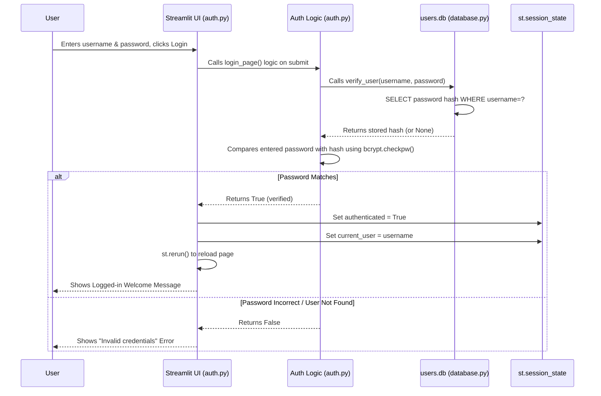

# Chapter 5: User Authentication

Welcome to Chapter 5! In the [previous chapter](04_ai_research_assistant_logic_.md), we explored the "brain" of our app – the AI Research Assistant that helps answer questions about PubMed articles. We saw how it uses external tools like OpenAI to provide intelligent responses.

Now, let's think about security and personalization. Imagine our app is like a library. Anyone can walk in and browse the public shelves (basic search). But what if you want a personal library card to check out books (save search history) or use special study rooms (AI assistant features)? You need a way to identify yourself and prove who you are.

This chapter is about **User Authentication** – our application's security desk. Its job is to:

1.  Help new users **register** (sign up).
2.  **Verify** their identity (usually via email).
3.  Allow returning users to **log in**.
4.  Control access to personalized features.

Think of it as the friendly guard who checks your library card or helps you sign up for one before letting you into the members-only sections.

## The Problem: Securing Personal Features

Why do we even need login? Our app aims to offer features like:

*   Saving your past searches ([Search History Management](06_search_history_management_.md)).
*   Having personalized conversations with the [AI Research Assistant Logic](04_ai_research_assistant_logic_.md).

These features need to be tied to a specific user. We can't show *your* search history to someone else! Therefore, we need a reliable way to know *who* is using the app. User authentication solves this by providing a secure way for users to create accounts and log in.

## What User Authentication Does

Our authentication system handles three main tasks:

1.  **Registration:** Allows new users to create an account. This involves:
    *   Collecting an email address.
    *   Sending a One-Time Password (OTP) to that email to verify it's real and belongs to the user.
    *   Letting the user choose a unique username and a password.
    *   Storing the username and a *securely scrambled* version of the password in our database.
2.  **Login:** Allows existing users to access their account. This involves:
    *   Asking for their username and password.
    *   Checking if the entered password matches the scrambled version stored in the database for that username.
    *   If it matches, marking the user as "logged in" within the app's memory ([Streamlit App Structure & State](01_streamlit_app_structure___state_.md)).
3.  **Access Control:** Checks if a user is logged in before allowing them to use certain pages or features (like viewing their profile or search history).

## How It Works: The User Experience

When you first open the app, if you're not logged in, you'll typically see options to either "Login" or "Register".

**Registration Flow:**

1.  You click "Register".
2.  You're asked for your email address.
3.  You enter your email and click "Send OTP".
4.  The system generates a secret code (OTP) and emails it to you.
5.  You check your email, get the OTP, and return to the app.
6.  You now fill in your desired username, password (twice, to confirm), and the OTP you received.
7.  You click "Register".
8.  If the OTP is correct, the passwords match, and the username isn't already taken, your account is created! You'll usually be asked to log in now.

**Login Flow:**

1.  You click "Login".
2.  You enter the username and password you created during registration.
3.  You click "Login".
4.  The system checks your credentials. If they are correct, you're logged in!
5.  The app now "remembers" you are logged in (using `st.session_state.authenticated = True`) and you can access personalized features.

## Under the Hood: Security and Storage

How does the app securely handle your password and verify your identity? Let's look behind the scenes.

**1. Storing Credentials Securely (The Database)**

We use a simple local database file (`users.db`) managed by Python's built-in `sqlite3` library. Think of this file like a locked filing cabinet just for user credentials.

*   **File:** `database.py`

```python
# database.py (Simplified Snippet - Initialize Database)
import sqlite3
import bcrypt # Library for password hashing

def init_db():
    """Creates the users table if it doesn't exist."""
    conn = sqlite3.connect('users.db') # Connects to the database file
    c = conn.cursor()
    # Create a table with columns for username, password, email
    c.execute('''CREATE TABLE IF NOT EXISTS users
                 (username TEXT PRIMARY KEY, password TEXT, email TEXT)''')
    conn.commit() # Save changes
    conn.close() # Close connection
```

*Explanation:* The `init_db` function ensures our `users.db` file has a table named `users`. This table will store the `username` (which must be unique - `PRIMARY KEY`), the scrambled `password`, and the user's `email`.

**2. Scrambling Passwords (Hashing with bcrypt)**

We **never** store your actual password! That would be very insecure. Instead, we use a strong cryptographic technique called **hashing** (specifically, using the `bcrypt` library).

Imagine putting your password into a special blender (`bcrypt`). It mixes it up so thoroughly that you get a long, unique string of gibberish (the "hash"). You can't easily put the gibberish back into the blender and get the original password out.

*   **File:** `database.py`

```python
# database.py (Simplified Snippet - Registering a User)
def register_user(username, password, email):
    """Registers a new user, hashing the password."""
    conn = sqlite3.connect('users.db')
    c = conn.cursor()
    try:
        # 1. Hash the password using bcrypt's blender
        hashed_pw = bcrypt.hashpw(password.encode(), bcrypt.gensalt())

        # 2. Store username, *hashed* password, and email
        c.execute("INSERT INTO users (username, password, email) VALUES (?, ?, ?)",
                  (username, hashed_pw, email))
        conn.commit()
        return True # Success!
    except sqlite3.IntegrityError:
        # This happens if the username already exists
        return False # Failed (username taken)
    finally:
        conn.close()
```

*Explanation:* When registering, `register_user` takes the plain `password`, encodes it (turns it into bytes computers understand better), and uses `bcrypt.hashpw` to create the secure hash (`hashed_pw`). It's this `hashed_pw`, not the original password, that gets stored in the database.

**3. Verifying Passwords During Login**

When you log in, how does it check your password if it only stored the scrambled hash? `bcrypt` has a special function for this.

*   **File:** `database.py`

```python
# database.py (Simplified Snippet - Verifying a User)
def verify_user(username, password):
    """Checks if the entered password matches the stored hash."""
    conn = sqlite3.connect('users.db')
    c = conn.cursor()
    # 1. Find the stored hash for the given username
    c.execute("SELECT password FROM users WHERE username = ?", (username,))
    result = c.fetchone() # Get the first matching row (should be unique)
    conn.close()

    if result:
        stored_hash = result[0]
        # 2. Use bcrypt to compare the entered password with the stored hash
        if bcrypt.checkpw(password.encode(), stored_hash):
            return True # Passwords match!
    return False # Username not found or password incorrect
```

*Explanation:* `verify_user` fetches the `stored_hash` from the database for the entered `username`. Then, it uses `bcrypt.checkpw`. This function takes the plain password you just typed and the stored hash. It re-runs the *same* hashing process on your typed password and sees if the result matches the hash stored in the database. If they match, the password is correct!

**4. Sending the OTP Email**

To verify your email during registration, we need to send the OTP code. We use Python's `smtplib` to connect to an email service (like Gmail) and send the message.

*   **File:** `auth.py`

```python
# auth.py (Simplified Snippet - Generating OTP)
import random
import string

def generate_otp(length=6):
    """Generates a random string of digits."""
    return ''.join(random.choices(string.digits, k=length))
```

```python
# auth.py (Simplified Snippet - Sending OTP Email)
import smtplib
from email.mime.text import MIMEText
from config import EMAIL, APP_PASSWORD # Your app's email credentials

def send_otp_email(email, otp):
    """Sends the OTP code to the user's email."""
    try:
        # Construct the email message
        msg = MIMEText(f"Your OTP for registration is: {otp}")
        msg['Subject'] = 'PubMed Search Registration OTP'
        msg['From'] = EMAIL
        msg['To'] = email

        # Connect to the email server (e.g., Gmail) and send
        with smtplib.SMTP('smtp.gmail.com', 587) as server:
            server.starttls() # Secure the connection
            server.login(EMAIL, APP_PASSWORD.replace(" ", "")) # Login to app's email
            server.send_message(msg)
        return True # Success
    except Exception as e:
        # Log the error (in a real app, handle more gracefully)
        print(f"Failed to send OTP: {e}")
        return False # Failed
```

*Explanation:* `generate_otp` creates a simple random code. `send_otp_email` uses credentials stored in `config.py` to log into an email account (like a dedicated Gmail account for the app) and sends the formatted email containing the OTP to the user's provided address. *Note: Using Gmail requires setting up an "App Password" in your Google account settings for security.*

**5. Handling Login and Registration Forms**

The `auth.py` file uses Streamlit's form elements (`st.form`) to group inputs together and process them when the user clicks a submit button.

*   **File:** `auth.py`

```python
# auth.py (Simplified Snippet - Login Form Logic)
import streamlit as st
# Assume verify_user is imported from database.py

def login_page():
    st.title("Login")
    with st.form(key='login_form'):
        username = st.text_input("Username")
        password = st.text_input("Password", type="password") # Hides input
        submit_button = st.form_submit_button(label="Login")

        if submit_button:
            # Call the verification function from database.py
            if verify_user(username, password):
                # SUCCESS! Update the app's memory (session state)
                st.session_state.authenticated = True
                st.session_state.current_user = username
                st.success(f"Welcome, {username}!")
                st.rerun() # Refresh the page to show logged-in view
            else:
                st.error("Invalid username or password")
```

*Explanation:* The `login_page` function creates the form fields. When the "Login" button is clicked (`submit_button` is `True`), it calls `verify_user`. If `verify_user` returns `True`, it updates `st.session_state.authenticated` and `st.session_state.current_user` (covered in [Streamlit App Structure & State](01_streamlit_app_structure___state_.md)) to mark the user as logged in for the rest of their session. `st.rerun()` tells Streamlit to reload the app, which will now show the main content because `st.session_state.authenticated` is `True`. The `registration_page` function works similarly but includes the OTP steps.

**6. Visualization: Login Flow**



*Walkthrough:* The diagram shows how the UI (Streamlit form) triggers the authentication logic, which calls the database function to check credentials. If successful, the session state is updated, and the UI reflects the logged-in status.

## Conclusion

User Authentication is the essential security layer for our application. It acts like a security desk, managing user **registration** (with secure password **hashing** using bcrypt and **OTP email verification**) and **login**.

We saw how `database.py` handles storing and verifying credentials securely in an SQLite database, and how `auth.py` orchestrates the user interface forms, OTP generation/sending, and updates the application's memory (`st.session_state`) upon successful authentication. This ensures that only registered and verified users can access personalized features.

Now that we know *who* the user is, how can we use that information to provide features like saving their previous searches? In the next chapter, we'll explore exactly that: [Search History Management](06_search_history_management_.md).

---

Generated by [AI Codebase Knowledge Builder](https://github.com/The-Pocket/Tutorial-Codebase-Knowledge)