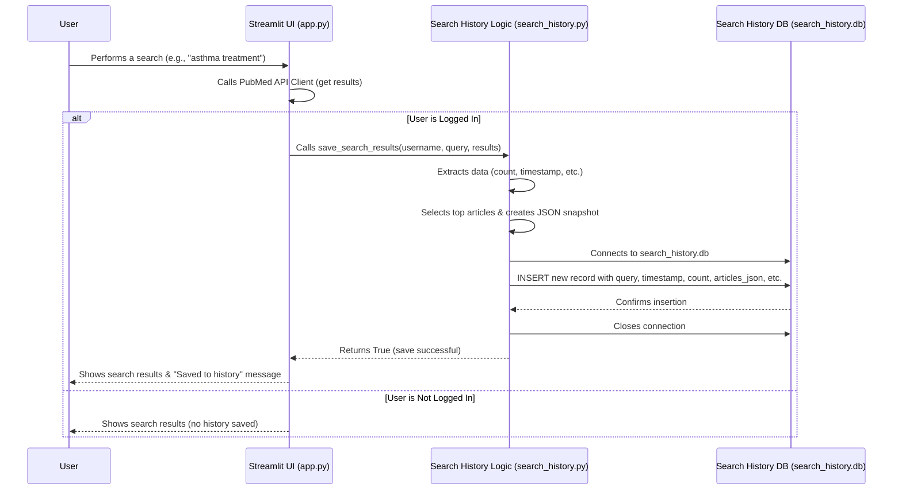

# Chapter 6: Search History Management

Welcome to Chapter 6! In the [previous chapter on User Authentication](05_user_authentication_.md), we learned how our app makes sure it knows who you are when you log in. It's like getting your personal library card. Now that the app can recognize you, wouldn't it be great if it could also remember what you've searched for previously?

Imagine you spent time crafting the perfect search query for "new therapies for asthma in children" last week. This week, you want to check if there are any new articles, but you can't quite remember the exact terms you used. Or maybe you just want to look back at the articles you found during a specific research session.

This chapter explores **Search History Management**, which acts like your personal research logbook within the app.

## The Problem: Remembering Your Searches

Doing research often involves running multiple searches over time. Without a history feature, you'd have to:

*   Retype complex search queries every time.
*   Try to remember which searches yielded the best results.
*   Manually keep notes outside the app about what you found and when.

This is tedious and inefficient. Our Search History Management feature solves this by automatically keeping a record of your search activities when you are logged in.

## What Search History Management Does

This part of our application is like a dedicated diary for your searches. Its main jobs are:

1.  **Saving Searches:** Every time a logged-in user performs a search using the [PubMed API Client](02_pubmed_api_client_.md), the system automatically saves key details:
    *   The search query used.
    *   *When* the search was performed (timestamp).
    *   *How many* results were found (total count).
    *   A *snapshot* of the top few articles found (title, authors, etc.).
    *   Technical details needed to potentially fetch more results later (`WebEnv`, `QueryKey`).
2.  **Listing Past Searches:** Allows you to view a list of all the searches you've saved, usually showing the query, date, and result count.
3.  **Viewing Search Details:** Lets you click on a past search to see the specific details saved, including the snapshot of the top articles.
4.  **Deleting Searches:** Gives you control to remove individual searches or clear your entire history.
5.  **Reloading Searches:** Provides a quick way to rerun a previous search query or load the saved results back into the main search view.

## How It Works: The User Experience

For you, the user, search history management is mostly automatic and accessed through a dedicated page:

1.  **Automatic Saving:** When you are logged in via [User Authentication](05_user_authentication_.md) and you perform a search on the main page (`app.py`), the details are automatically saved in the background. You might see a small confirmation message like "✅ Search saved to history".
2.  **Accessing History:** You can navigate to the "Search History" page (likely found via a button in the sidebar or a dedicated page link, handled by `pages/5_search_history.py` in our project).
3.  **Viewing the List:** On the history page, you'll see your past searches listed, usually starting with the most recent. Each entry might show the query, date, and number of results.
4.  **Interacting with History:** For each search in the list, you'll typically see buttons like:
    *   **Details:** Shows you the saved information for that specific search, including the snapshot of articles.
    *   **Load:** Takes you back to the main search page and tries to load the results or re-run the query associated with that history entry.
    *   **Delete:** Removes that specific search entry from your history.
5.  **Clearing History:** There might also be an option on the history page to delete *all* your saved searches.

## Under the Hood: Storage and Logic

How does the app actually store and manage all this history data for potentially many different users?

**1. Separate Storage: The Search History Database**

Just like we used a database (`users.db`) for user logins in the [User Authentication](05_user_authentication_.md) chapter, we use *another*, separate database file for search history. This file is typically called `search_history.db` and is managed by the code in `search_history.py`.

Why a separate database?
*   **Organization:** Keeps user login information strictly separate from their activity data.
*   **Scalability:** If one type of data grows much larger, it doesn't necessarily slow down access to the other.

This database file contains a table, let's call it `search_history`, structured like this:

| Column         | Description                                                    | Data Type      |
| :------------- | :------------------------------------------------------------- | :------------- |
| `id`           | Unique identifier for each saved search record                 | INTEGER        |
| `username`     | The user who performed the search (links to `users.db`)        | TEXT           |
| `query`        | The exact search query string used                             | TEXT           |
| `timestamp`    | When the search was performed                                  | TEXT (ISO 8601)|
| `result_count` | Total number of articles found by the search                   | INTEGER        |
| `articles`     | Snapshot of top articles (stored as JSON text)                 | TEXT (JSON)    |
| `webenv`       | Technical identifier from PubMed for pagination/history        | TEXT           |
| `query_key`    | Another technical identifier from PubMed                       | TEXT           |

**2. Saving a Search (`save_search_results` in `search_history.py`)**

This function is the core of saving. It's called from our main application (`app.py`) right after a successful search is performed by a logged-in user.

*   **Input:** Username, the search query string, and the results dictionary returned by the [PubMed API Client](02_pubmed_api_client_.md).
*   **Process:**
    *   Connects to the `search_history.db` database.
    *   Gets the current date and time.
    *   Extracts the total `result_count` from the results.
    *   Takes the *first few* articles (e.g., top 5 or 10) from the results list.
    *   Extracts key details (PMID, title, authors, etc.) for *only* these top articles. To save space, it might shorten the abstract.
    *   Converts this list of top article details into a JSON string (a text format that's easy to store and read later).
    *   Extracts the `webenv` and `query_key` if available.
    *   Inserts a new row into the `search_history` table with all this information.
    *   Closes the database connection.

```python
# search_history.py (Simplified Snippet - Saving a Search)
import sqlite3
import json
from datetime import datetime

SEARCH_HISTORY_DB = 'data/search_history.db' # Path to the database file

def save_search_results(username, query, results):
    """Saves a search record to the history database."""
    conn = None # Initialize connection variable
    try:
        conn = sqlite3.connect(SEARCH_HISTORY_DB)
        cursor = conn.cursor()

        # --- Prepare data for saving ---
        timestamp = datetime.now().isoformat()
        count = results.get('count', 0)
        webenv = results.get('webenv')
        query_key = results.get('query_key')

        # Take only the top N articles (e.g., 5) for the snapshot
        top_articles_raw = results.get('articles', [])[:5]
        # Extract specific fields and shorten abstract
        articles_snapshot = [
            {
                'pmid': art.get('pmid'), 'title': art.get('title'),
                'authors': art.get('authors'), 'journal': art.get('journal'),
                'abstract': art.get('abstract', '')[:200] + '...' # Shorten abstract
            }
            for art in top_articles_raw
        ]
        # Convert snapshot list to JSON text
        articles_json = json.dumps(articles_snapshot)

        # --- Insert into database ---
        cursor.execute(
            """INSERT INTO search_history
               (username, query, timestamp, result_count, articles, webenv, query_key)
               VALUES (?, ?, ?, ?, ?, ?, ?)""",
            (username, query, timestamp, count, articles_json, webenv, query_key)
        )
        conn.commit()
        return True # Indicate success
    except Exception as e:
        print(f"Error saving history: {e}") # Log error
        return False # Indicate failure
    finally:
        if conn:
            conn.close() # Always close the connection
```

*Explanation:* This function takes the user, query, and results. It prepares the data, importantly converting the list of top article details into a compact JSON text string using `json.dumps()`. Then, it uses SQL's `INSERT` command to add a new record to the `search_history` table. Error handling ensures the database connection is closed even if something goes wrong.

**3. Retrieving the History List (`get_user_search_history` in `search_history.py`)**

This function is called by the Search History page (`pages/5_search_history.py`) to display the list of past searches.

*   **Input:** Username.
*   **Process:**
    *   Connects to `search_history.db`.
    *   Selects the `id`, `query`, `timestamp`, and `result_count` for all records matching the given `username`.
    *   Orders the results by `timestamp` (newest first).
    *   Fetches the results and formats them into a list of simple dictionaries.
    *   Closes the connection.
*   **Output:** A list like `[{'id': 10, 'query': 'cancer treatment', 'timestamp': '...', 'result_count': 150}, {'id': 9, ...}]`.

```python
# search_history.py (Simplified Snippet - Getting History List)
import sqlite3

def get_user_search_history(username, limit=20):
    """Retrieves the list of searches for a user."""
    conn = None
    try:
        conn = sqlite3.connect(SEARCH_HISTORY_DB)
        cursor = conn.cursor()
        # Select only the columns needed for the list view
        cursor.execute(
            """SELECT id, query, timestamp, result_count
               FROM search_history WHERE username = ?
               ORDER BY timestamp DESC LIMIT ?""",
            (username, limit) # Use parameters to prevent SQL injection
        )
        # Fetch all matching rows
        rows = cursor.fetchall()
        # Convert rows to list of dictionaries
        history_list = [
            {'id': r[0], 'query': r[1], 'timestamp': r[2], 'result_count': r[3]}
            for r in rows
        ]
        return history_list
    except Exception as e:
        print(f"Error getting history list: {e}")
        return []
    finally:
        if conn:
            conn.close()
```

*Explanation:* This function uses SQL's `SELECT` command to get specific columns for the user, ordered by date (`ORDER BY timestamp DESC`), and limits the number (`LIMIT ?`). It converts the raw database rows into a more usable list of Python dictionaries.

**4. Viewing Details (`get_search_details` in `search_history.py`)**

Called when the user clicks the "Details" button for a specific search.

*   **Input:** The unique `search_id` of the history record, and the `username` (for security, ensuring users only see their own details).
*   **Process:**
    *   Connects to the database.
    *   Selects *all* columns for the record matching the `search_id` *and* `username`.
    *   Fetches the single matching record.
    *   If found, takes the `articles` JSON string from the record.
    *   Uses `json.loads()` to parse the JSON string back into a Python list of article dictionaries.
    *   Constructs and returns a dictionary containing all the details, including the parsed article list.
    *   Closes the connection.

```python
# search_history.py (Simplified Snippet - Getting Search Details)
import sqlite3
import json

def get_search_details(search_id, username):
    """Retrieves full details for a specific search ID."""
    conn = None
    try:
        conn = sqlite3.connect(SEARCH_HISTORY_DB)
        cursor = conn.cursor()
        # Select all columns for the specific ID and user
        cursor.execute(
            """SELECT id, query, timestamp, result_count, articles, webenv, query_key
               FROM search_history WHERE id = ? AND username = ?""",
            (search_id, username)
        )
        row = cursor.fetchone() # Get the single result

        if row:
            # Parse the stored JSON string back into a Python list
            articles_list = json.loads(row[4]) if row[4] else []
            details = {
                'id': row[0], 'query': row[1], 'timestamp': row[2],
                'result_count': row[3], 'articles': articles_list, # Use the parsed list
                'webenv': row[5], 'query_key': row[6]
            }
            return details
        else:
            return None # Not found or doesn't belong to user
    except Exception as e:
        print(f"Error getting search details: {e}")
        return None
    finally:
        if conn:
            conn.close()
```

*Explanation:* Similar to getting the list, but fetches all columns for a single ID. The key step is `json.loads(row[4])`, which reverses the process of `json.dumps()` done during saving, turning the stored text back into a usable Python list of dictionaries.

**5. Reloading a Search**

This action is usually handled within the Search History page (`pages/5_search_history.py`). When the "Load" button is clicked:

1.  It calls `get_search_details(search_id, username)` to get the saved data.
2.  If details are found:
    *   It updates the app's memory ([Streamlit App Structure & State](01_streamlit_app_structure___state_.md)) by setting `st.session_state.current_query` to the saved query.
    *   It sets `st.session_state.search_results` to a dictionary containing the saved `result_count`, the saved `articles` snapshot, and the saved `webenv`/`query_key`.
    *   It resets `st.session_state.page_number` to 0.
    *   It uses `st.switch_page("app.py")` to navigate the user back to the main search page.
3.  The main search page (`app.py`) then sees the `search_results` in `st.session_state` and displays the loaded information.

**6. Visualization: Saving a Search Flow**



*Walkthrough:* When a logged-in user searches, the UI (`app.py`) gets the results and then calls the `save_search_results` function in our history logic (`search_history.py`). This function processes the data, creates the JSON snapshot, and inserts it into the `search_history.db`.

## Conclusion

Search History Management provides a valuable "memory" for our users, acting like a personal research logbook. It automatically saves key details about searches performed by logged-in users into a dedicated SQLite database (`search_history.db`), managed by functions within `search_history.py`.

We learned how searches are saved (including a snapshot of top articles stored as JSON), how the list of past searches is retrieved, how users can view details (parsing the JSON back), delete records, and reload previous searches by manipulating the app's memory (`st.session_state`). This feature greatly enhances the usability of the research tool by allowing users to easily revisit and manage their past work.

With features like authentication and history in place, making sure the application runs smoothly and consistently requires managing various settings. In the next chapter, we'll look at [Configuration Management](07_configuration_management_.md).

---

Generated by [AI Codebase Knowledge Builder](https://github.com/The-Pocket/Tutorial-Codebase-Knowledge)