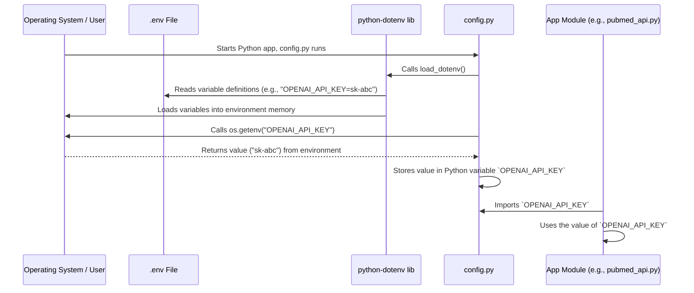

# Chapter 7: Configuration Management

Welcome to the final chapter of our tutorial! In the [previous chapter on Search History Management](06_search_history_management_.md), we saw how our application remembers the searches you perform when you're logged in, acting like a personal logbook. Throughout the tutorial, we've seen references to things like API keys and email credentials – how does the app know what these secret codes are?

Imagine our app needs to connect to several external services:
*   PubMed (using the NCBI E-utilities) might need an API key for faster access ([PubMed API Client](02_pubmed_api_client_.md)).
*   The [AI Research Assistant Logic](04_ai_research_assistant_logic_.md) needs an API key to talk to OpenAI.
*   The [User Authentication](05_user_authentication_.md) system needs an email address and a special app password to send OTP emails via Gmail.

Where should we store these important keys and addresses? We definitely *shouldn't* write them directly into our main Python code (`app.py`, `pubmed_api.py`, etc.). If we did, anyone looking at our code would see our secrets! Also, what if we want to use a different email address or API key later? We'd have to hunt through the code to find and change them.

This chapter introduces **Configuration Management**, which acts like our application's secure settings panel or key storage box. It provides a safe and organized way to handle these settings, especially the secret ones.

## The Problem: Managing Settings and Secrets

Hardcoding settings directly into your application code is problematic:

1.  **Security Risk:** Sensitive information like API keys or passwords becomes visible in the codebase. If you share your code (e.g., on GitHub), you might accidentally expose your secrets.
2.  **Inflexibility:** If a setting needs to change (e.g., switching from a test database to a real one, or updating an API key), you have to modify the code itself.
3.  **Difficult Collaboration:** Different developers on a team might need to use different settings (e.g., their own test API keys) during development. Managing this in the code is messy.

We need a system that keeps settings separate from the code, especially secrets, and makes it easy to change them without touching the main logic.

## What is Configuration Management?

Configuration Management in our project is a simple but effective system designed to:

1.  **Centralize Settings:** Keep all external settings (like API keys, URLs, email addresses) defined in one place.
2.  **Use Environment Variables:** Read settings from the "environment" the application is running in. Environment variables are like little labels or notes that exist outside the application code itself.
3.  **Load from a `.env` File:** During development, easily manage these environment variables using a special file named `.env`. This file is *not* shared publicly.
4.  **Provide Defaults:** Offer sensible default values for settings in case they aren't provided in the environment.
5.  **Keep Secrets Out:** Ensure sensitive data like API keys and passwords never get accidentally committed to version control systems like Git.

It's like having a locked box (`.env` file) next to your application where you keep all the secret keys and important addresses. A helper (`python-dotenv` library) reads the labels from the box and tells the application what they are when it starts. The application itself just looks at its settings dashboard (`config.py`) to know which key or address to use.

## Key Tools We Use

Our system relies on a few key parts:

1.  **Environment Variables:** These are variables set *outside* the Python script, usually by the operating system or a tool before the script runs. Think of them as sticky notes attached to the computer running the app, saying `OPENAI_API_KEY=sk-abc...` or `EMAIL=my_app@gmail.com`.
2.  **`.env` File:** A simple text file (literally named `.env`) where we list our environment variables for local development. Each line follows the format `VARIABLE_NAME=value`. This file is **crucial** for security – we tell Git (our version control system) to *ignore* this file, so our secrets don't end up online.
3.  **`python-dotenv` Library:** A Python package that automatically reads the `.env` file when our application starts and loads the variables defined inside it into the actual environment, making them accessible to our script.
4.  **`config.py` File:** A central Python file within our project. This file:
    *   Imports the `os` library to read environment variables.
    *   Uses `load_dotenv()` from the `python-dotenv` library (usually at the top).
    *   Defines Python variables (like `OPENAI_API_KEY`, `EMAIL`, `BASE_URL`) that read their values from the environment using `os.getenv('VARIABLE_NAME', 'default_value')`.
    *   Provides a default value (`'default_value'`) in case the environment variable isn't set.
    *   Other parts of our application import settings *only* from this `config.py` file.

## How We Use Configuration Management

Let's see how these pieces fit together.

**Step 1: Create the `.env` file**

In the main directory of our project, we create a file named `.env`. This file is **private** and should **not** be shared or committed to Git.

```text
# .env (Example - DO NOT COMMIT!)

# OpenAI API Key
OPENAI_API_KEY=sk-YOUR_REAL_OPENAI_API_KEY_HERE

# NCBI API Key (Optional, but recommended)
NCBI_API_KEY=YOUR_REAL_NCBI_API_KEY_HERE

# Gmail credentials for sending OTP emails
GMAIL_ADDRESS=your_app_email@gmail.com
GMAIL_APP_PASSWORD=abcd efgh ijkl mnop # Use Google App Password
```

*Explanation:* This file defines the environment variables we need. Replace the placeholder values with your actual secret keys and credentials. Remember to add `.env` to your `.gitignore` file!

**Step 2: Create the `config.py` file**

This file reads the environment variables (loaded from `.env` by `python-dotenv`) and makes them available to the rest of the app.

```python
# config.py (Simplified)
import os
from dotenv import load_dotenv

# Load variables from .env file into the environment
load_dotenv()

# === NCBI E-utilities Settings ===
# Base URL for NCBI API calls
BASE_URL = "https://eutils.ncbi.nlm.nih.gov/entrez/eutils/"
# Email for NCBI API identification (provide a default)
EMAIL = os.getenv("GMAIL_ADDRESS", "default_email@example.com")
# Tool name for NCBI API identification
TOOL = "streamlit-pubmed-app"
# NCBI API Key (optional, returns None if not set)
NCBI_API_KEY = os.getenv("NCBI_API_KEY")

# === OpenAI Settings ===
# OpenAI API Key (crucial for AI features)
OPENAI_API_KEY = os.getenv("OPENAI_API_KEY")

# === Email (Gmail) Settings for OTP ===
# Special password generated in Google Account settings
APP_PASSWORD = os.getenv("GMAIL_APP_PASSWORD", " ")
```

*Explanation:*
*   `load_dotenv()` reads the `.env` file.
*   `os.getenv("VARIABLE_NAME", "default")` tries to read the variable `VARIABLE_NAME` from the environment.
*   If `VARIABLE_NAME` is found (because it was in `.env` or set by the system), its value is used.
*   If it's *not* found, the `default` value provided is used instead (e.g., `"default_email@example.com"` for `EMAIL`). For keys like `NCBI_API_KEY`, we might not provide a default, so `os.getenv` returns `None`.
*   The rest of our app will import these variables (like `EMAIL`, `OPENAI_API_KEY`) directly from `config.py`.

**Step 3: Use the Configuration in Other Modules**

Now, other parts of the application, like the [PubMed API Client](02_pubmed_api_client_.md) or the [User Authentication](05_user_authentication_.md) logic, can simply import and use these settings.

```python
# pubmed_api.py (Simplified Snippet)
import requests
# Import the configuration variables from our config.py file
from config import BASE_URL, EMAIL, TOOL, NCBI_API_KEY

def search_pubmed(query, max_results=20):
    search_url = f"{BASE_URL}esearch.fcgi"
    search_params = {
        "db": "pubmed",
        "term": query,
        "tool": TOOL,       # Use TOOL from config
        "email": EMAIL,     # Use EMAIL from config
        # ... other parameters ...
    }
    if NCBI_API_KEY: # Check if the key exists (was read from env)
        search_params["api_key"] = NCBI_API_KEY # Use NCBI_API_KEY from config

    # ... send request using requests.get(search_url, params=search_params) ...
    # ... rest of the function ...
```

*Explanation:* This module imports `BASE_URL`, `EMAIL`, `TOOL`, and `NCBI_API_KEY` from our central `config.py`. It doesn't need to know *how* these values were obtained (from `.env` or defaults); it just uses them.

## Under the Hood: The Configuration Loading Flow

Let's visualize how the application gets its settings when it starts up.



**Walkthrough:**

1.  **App Start:** The Python application begins, and `config.py` is executed (often very early, either directly or when first imported).
2.  **Load `.env`:** The `load_dotenv()` function is called within `config.py`.
3.  **Read File:** The `python-dotenv` library finds and reads the `.env` file in the project directory.
4.  **Set Environment:** For each line like `VAR=VALUE` in `.env`, `python-dotenv` sets an environment variable `VAR` with the value `VALUE` within the current process's environment memory.
5.  **Read Environment:** `config.py` then uses `os.getenv('VAR', 'default')` to read these environment variables.
6.  **Assign Variables:** The values read (or the defaults) are assigned to Python variables within `config.py` (e.g., `OPENAI_API_KEY = "sk-abc..."`).
7.  **Import & Use:** Other modules (like `pubmed_api.py`, `auth.py`, `chatbot_logic.py`) import these variables from `config.py` and use them.

This ensures that settings are loaded consistently and securely from the environment (populated by `.env` locally) or fall back to defaults, all managed through the central `config.py` file.

## Why `.gitignore` is Your Friend

The `.env` file contains your secrets! You absolutely do *not* want to commit it to Git. If you do, anyone who can see your repository can see your API keys and passwords.

You need to add `.env` to a special file called `.gitignore` in your project's root directory.

```text
# .gitignore (Example)

# Ignore Python cache files
__pycache__/
*.pyc

# Ignore virtual environment folder
venv/
.venv/

# Ignore database files (if local)
*.db
*.sqlite3

# CRITICAL: Ignore the .env file containing secrets!
.env
```

*Explanation:* This tells Git to completely ignore the `.env` file (and other listed files/folders). It won't track changes to it and won't upload it when you push your code to platforms like GitHub.

## Conclusion

Configuration Management is like creating a dedicated, secure settings panel for our application. By using environment variables, loaded conveniently from a private `.env` file during development via `python-dotenv`, and accessed centrally through our `config.py` module, we achieve several key benefits:

*   **Security:** Sensitive information (API keys, passwords) is kept out of the main codebase and out of version control (thanks to `.gitignore`).
*   **Flexibility:** Settings can be easily changed by modifying the `.env` file (locally) or setting environment variables on a server, without touching the application code.
*   **Organization:** All external configurations are managed in one place (`config.py`), making the code cleaner and easier to understand.
*   **Collaboration:** Team members can use their own `.env` files with their specific keys without conflicts in the shared code.

This system provides a robust and beginner-friendly way to handle application settings, making our `pubmed` app more secure, flexible, and maintainable. Congratulations on completing this tutorial series! You've explored the structure, data fetching, presentation, AI integration, authentication, history, and configuration of a real-world Streamlit application.

---

