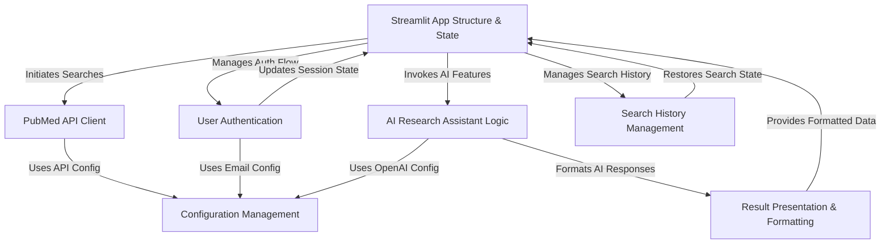

# Tutorial: pubmed

This project is a **web application** built with *Streamlit* that acts as an enhanced interface for the *PubMed* medical literature database.
Users can search for articles, view results, and visualize publication trends.
Logged-in users benefit from personalized **search history** management.
A key feature is the **AI Research Assistant**, powered by *OpenAI*, which helps users understand medical terms, analyze research methodologies, and identify research gaps directly within the application.

**Source Repository:** [None](None)

## Chapters

1. [Streamlit App Structure & State
](01_streamlit_app_structure___state_.md)
2. [PubMed API Client
](02_pubmed_api_client_.md)
3. [Result Presentation & Formatting
](03_result_presentation___formatting_.md)
4. [AI Research Assistant Logic
](04_ai_research_assistant_logic_.md)
5. [User Authentication
](05_user_authentication_.md)
6. [Search History Management
](06_search_history_management_.md)
7. [Configuration Management
](07_configuration_management_.md)

----
